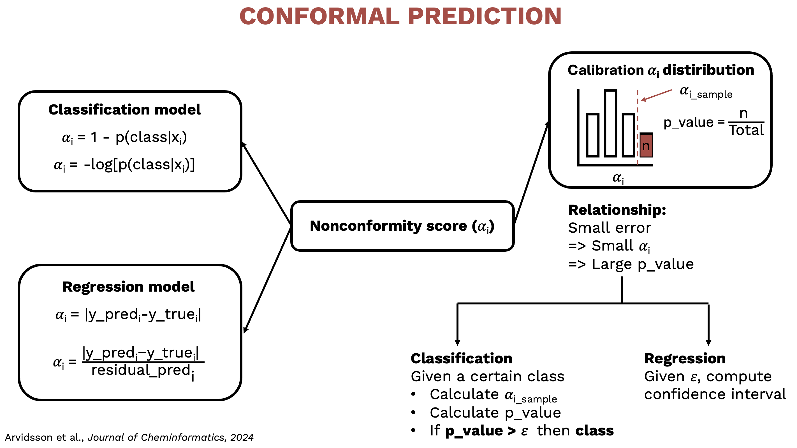

# Conformal Prediction Exercise

This repository contains an exercise exploring conformal prediction techniques applied to a dataset of chemical compounds with Ki (inhibition constant) values measured in nanomolar (nM) units.

  

## Methodology

This project follows a comprehensive approach to conformal prediction:

### 1. Data Cleaning and Standardizing
- Preprocessing of compound data
- Handling missing values and outliers
- Standardization of features for consistent model input

### 2. Feature Engineering
- Extraction and transformation of molecular descriptors
- Creation of relevant features for compound activity prediction
- Feature selection and dimensionality reduction techniques

### 3. Regression and Classification Selection
- Model selection and comparison for both regression and classification tasks
- Evaluation of different algorithms for Ki value prediction
- Performance assessment using appropriate metrics

### 4. Conformal Prediction Investigation
- Implementation of conformal prediction frameworks
- Analyse validity and efficiency trade-off

## Acknowledgments

This project acknowledges and builds upon the excellent work from:

- **pharmbio/plot_utils**: [https://github.com/pharmbio/plot_utils/tree/master](https://github.com/pharmbio/plot_utils/tree/master) - Visualization utilities for pharmaceutical and chemical data analysis
- **nonconformist**: [https://github.com/donlnz/nonconformist](https://github.com/donlnz/nonconformist) - Python library for conformal prediction implementation
